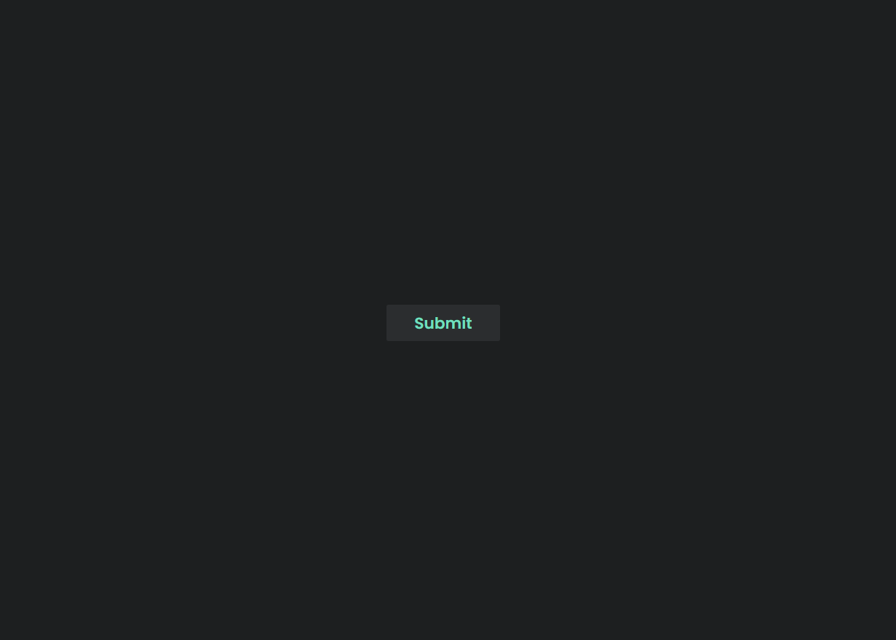

## Table of contents

- [Overview](#overview)
  - [The challenge](#the-challenge)
  - [Screenshot](#screenshot)
  - [Links](#links)
- [My process](#my-process)
  - [Built with](#built-with)
  - [What I learned](#what-i-learned)
  - [Continued development](#continued-development)
  - [Useful resources](#useful-resources)
- [Author](#author)
- [Acknowledgments](#acknowledgments)

## Overview
- This is a project I came across on WebDev Simplified on YouTube. The challenge was to recreate this button from the original on CodePen, but to do it using mostly CSS. The links to the CodePen and the YouTube are in the links section below.

### The challenge

Users should be able to:

- Click on the submit button, the button should collapse into a progress bar that shows a loading progress, then the button should bounce into a circle and the checkmark should animate to show completion.

### Screenshot

### Links

- Solution URL: [Add solution URL here](https://your-solution-url.com)
- Live Site URL: [Add live site URL here](https://your-live-site-url.com)

## My process

### Built with

- Semantic HTML5 markup
- CSS custom properties
- Flexbox
- JavaScript

### What I learned

I really liked learing about animation-fill-mode and how to find and use the timinmg curve animation in dev tools! Super helpful!

### Continued development

I am going to repeat this project two more times. The next one I am going to use Sass and make it using more of the JavaScript. The last one I will do with ReactJS.

### Useful resources

- [WebDev Simplified follow along](https://www.youtube.com/watch?v=RDLg-p6PdTA&list=PLWRlt24r8gTrkad4acuLMu10YoIEEc0CB&index=24&t=17s) - This is the video I followed along with and helped me get unstuck.
- [Andrew Millen CodePen](https://codepen.io/andrewmillen/pen/MoKLob) - This is the original project that uses JavaScript more than CSS.

## Author

- Website - [Michelle Renee](https://slimbloodworth.editorx.io/portfolio)
- Facebook - [Creative Software Solutions](https://www.facebook.com/profile.php?id=100073842390690)
- CodePen - [@slimbloodworth](https://codepen.io/slimbloodworth)
- LinkedIn - [Michelle Renee](https://www.linkedin.com/in/michelle-renee-99b455187/)
- GitHub - [@slimbloodworth](https://github.com/SlimBloodworth)

## Acknowledgments

-WebDev Simplified was a great resource for this challenge and as a whole and I'd really like to say thank you to all content creators who contribute to the learning process by sharing thier knowledge!

